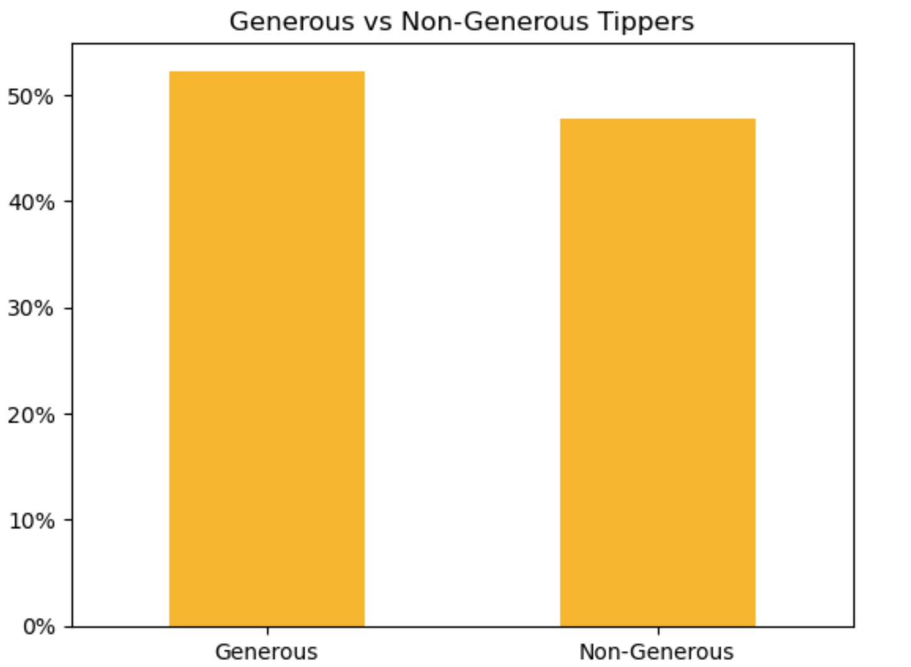
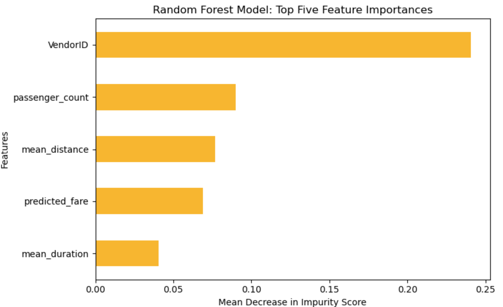

# Predicting Taxi Gratuities in New York City
This page is under construction.

**Overview**

This project aimed to develop predictive models for determining whether a New York City yellow taxi passenger would be a high tipper. Using 2017 taxi trip data, this project constructed multiple linear regression and random forest models. The random forest model demonstrated strong performance, accurately predicting high tippers 81% of the time and correctly identifying high tippers among predicted positives 68% of the time. The analysis revealed that trip duration, distance, and cost were the primary factors influencing tip generosity.

**Business Understanding**

Data from Glassdoor (2024) indicates that the average base salary for a New York City taxi driver is $43,637 annually. While tips, bonuses, and commissions can increase total earnings to an estimated $53,791, the median asking rent for public apartments in the city reached a record high of $3,500 per month in 2023 (source: [NYC Comptroller website](https://comptroller.nyc.gov/reports/spotlight-new-york-citys-rental-housing-market/#:~:text=As%20has%20been%20noted%20in,household%20income%20level%20in%202022.)). This significant housing cost highlights the importance of understanding what motivates riders to tip. By analyzing tipping behavior, we can help ensure that drivers are able to earn a livable wage in an expensive city like New York.

**Data Understanding**

The data was obtained from NYC.gov, provided by the NYC Taxi and Limousine Commission (TLC). This dataset included approximately 113 million unique taxi trips, described by 18 different features. These features provided details about the trips, including duration, destination, vendor, passenger count, toll information, and payment type used.

The breakdown of generous tippers (>20%) versus non-generous tippers that exist in the data set are reflected in this bar chart:

  

To enhance the dataset, a new feature was engineered indicating whether a trip occurred during rush hour. Additionally, unnecessary columns were removed and converted data to the appropriate formats for analysis.

**Modeling and Evaluation**

To identify the key factors influencing tip generosity, a random forest model was constructed using 300 decision trees. The model revealed that Vendor ID, passenger count, and distance were the most critical determinants of high tipping behavior. Overall, the model performed with 70% accuracy and 68% precision. 

  

**Conclusion**

These models can help to identify the primary factors influencing fare amount and assist taxi drivers in predicting the likelihood of receiving a generous tip. However, to quantify the exact impact of each factor on tip amount, a parametric model should be considered. Additionally, incorporating data on riders' past tipping behavior could further enhance the model's predictive capabilities and provide more actionable insights for taxi drivers.
